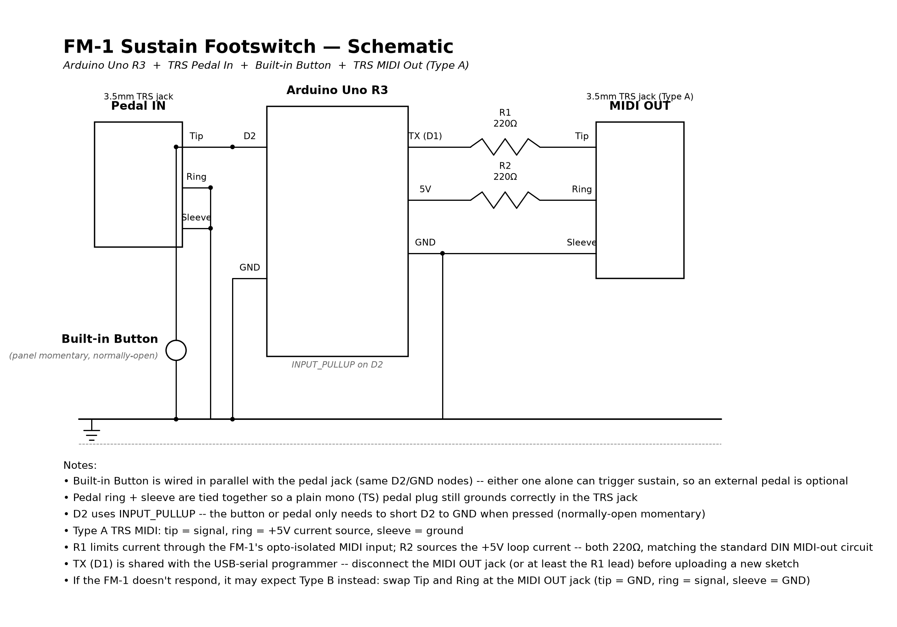
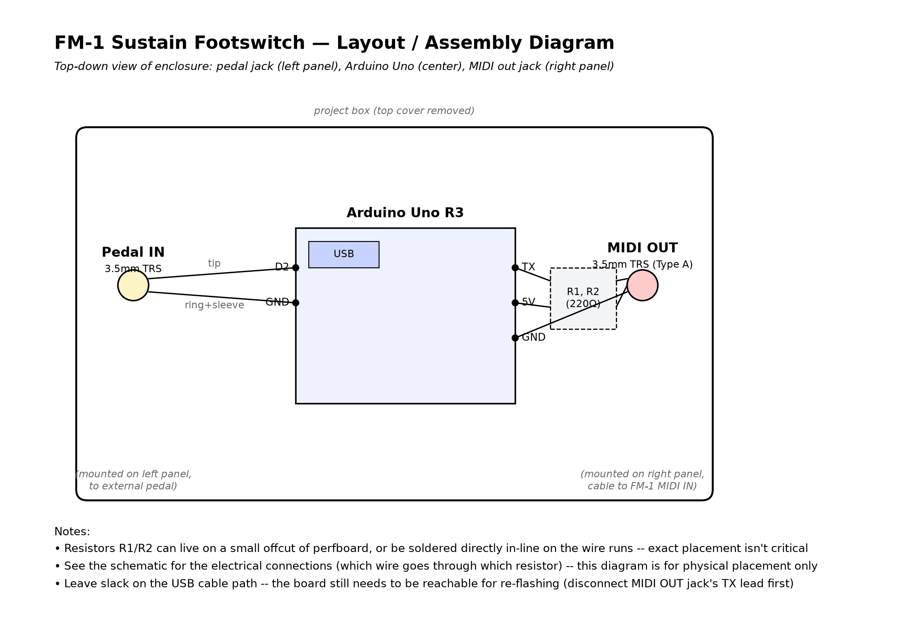

# fm1-sustain-footswitch

A small Arduino-based board that converts a 1/8" (3.5mm) sustain pedal into MIDI CC64 (sustain) for the [M-VAVE FM-1](https://www.m-vave.com/products), via its 3.5mm TRS MIDI IN. Includes a built-in panel pushbutton wired in parallel with the pedal jack, so sustain still works with no external pedal plugged in. A panel switch flips the OLED between Sustain status and a Pitch mode that reads the FM-1's own headphone output and displays the note, octave, frequency, and tuning offset being played.

Confirmed working end-to-end: physical pedal → Arduino → TRS MIDI (Type A) → FM-1 sustain.

## Schematic and layout

| Schematic | Physical layout |
|---|---|
| [](schematics/fm1_footswitch_schematic.pdf) | [](schematics/fm1_footswitch_layout.pdf) |

PDFs (linked above) are the high-res versions. `schematics/generate_fm1_footswitch_schematic.py` regenerates both from source (matplotlib; `pip install matplotlib` first).

## Why a board at all

MIDI is a serial protocol, so a plain switch-to-jack cable can't talk to the FM-1 directly — something has to turn "switch closed" into a `CC64` message. This uses the spare Arduino Uno R3 as that translator.

## Parts

- Arduino Uno R3
- 1/8" (3.5mm) TRS panel-mount jack, wired to the sustain pedal
- 1/8" (3.5mm) TRS panel-mount jack, for MIDI out
- Momentary panel pushbutton (normally-open SPST), for sustain with no pedal plugged in
- 2x 220ohm resistors
- 3.5mm TRS-to-TRS cable, to reach the FM-1's MIDI IN
- 0.96" I2C SSD1306 OLED (128x64), optional, shows live sustain status or pitch reading
- SPDT ON-ON toggle switch, to select Sustain vs Pitch display mode
- 1/8" (3.5mm) jack, wired to the FM-1's headphone output (Pitch mode only)
- 100kohm resistor, 1uF capacitor, 2x 10kohm resistors (Pitch mode audio bias circuit)

## Wiring

**Pedal input (TRS jack):**
```
pedal jack tip           -> Arduino D2
pedal jack ring + sleeve -> Arduino GND (tied together)
```
D2 is `INPUT_PULLUP`, so the pedal just needs to short tip to ring/sleeve when pressed. Ring and sleeve are tied together so a plain mono (TS) pedal plug still grounds correctly when inserted into the TRS jack. This covers the vast majority of 1/8" sustain pedals (simple momentary SPST, normally open).

**Built-in button (optional, for no pedal):**
```
button leg 1 -> Arduino D2   (same node as pedal jack tip)
button leg 2 -> Arduino GND  (same node as pedal jack ring/sleeve)
```
Wired straight in parallel with the pedal jack — no separate pin, no code changes. Either the button or the pedal alone can pull D2 low, so pressing the button works whether or not a pedal is plugged in. If a pedal *is* plugged in and its footswitch is a normally-closed momentary (rare), it'll hold D2 low all the time, which would also hold the panel button's effect at "always on" — not an issue for the standard normally-open pedals this is designed for.

**MIDI output (direct to TRS, Type A):**
```
Arduino TX (pin 1) -> 220ohm resistor -> TRS jack tip
Arduino 5V         -> 220ohm resistor -> TRS jack ring
Arduino GND        -> TRS jack sleeve
```
Then a plain 3.5mm TRS-to-TRS cable into the FM-1's MIDI IN.

**OLED status display (optional, I2C SSD1306 128x64):**
```
OLED GND -> Arduino GND
OLED VCC -> Arduino 5V
OLED SCL -> Arduino A5
OLED SDA -> Arduino A4
```
Requires the `Adafruit SSD1306`, `Adafruit GFX Library`, and `Adafruit BusIO` libraries.

**Mode switch (optional, SPDT ON-ON):**
```
switch common -> Arduino GND
switch throw 1 -> Arduino D3
switch throw 2 -> not connected
```
D3 is `INPUT_PULLUP`. Grounded (throw 1 selected) = **Pitch mode**. Floating/default (throw 2, or no switch installed) = **Sustain mode**, so the board works exactly as before if you skip this switch entirely. The pedal/button still sends CC64 sustain in either mode — the switch only changes what the OLED shows.

- **Sustain mode:** `SUSTAIN ON` / `SUSTAIN OFF`, updated whenever the debounced pedal/button state changes. This board has no MIDI input, so this is the only thing it can show without a switch.
- **Pitch mode:** note name + octave (large), frequency to 1 decimal, and tuning offset in cents — all read from the FM-1's own audio output (see below), not from MIDI. Shows `NO SIGNAL` when the signal is near-silent or the autocorrelation can't find a confident pitch. Refreshes roughly every 80-100ms; while in Pitch mode, sustain-pedal response lags by up to that much since capturing and analyzing audio blocks the loop — switch back to Sustain mode for the tightest pedal feel.

**Pitch mode audio input (optional, from FM-1 headphone out):**

The Arduino's ADC only reads 0-5V, but headphone output is an AC signal centered on 0V, so it needs a small bias/coupling circuit before it can be read on an analog pin:
```
FM-1 headphone out (tip, either channel) -> 100kohm resistor -> node X
node X -> 1uF capacitor -> Arduino A0
Arduino 5V  -> 10kohm resistor -> node Y
Arduino GND -> 10kohm resistor -> node Y
node Y -> Arduino A0                          (same node the cap feeds)
FM-1 headphone out sleeve (ground) -> Arduino GND
```
The two 10kohm resistors form a divider that biases A0 to ~2.5V at rest; the audio signal rides on top of that through the coupling cap, keeping the whole thing inside the ADC's 0-5V range. The 100kohm resistor limits current and knocks down the signal a bit as cheap insurance against clipping at high FM-1 volume.

Pitch detection is autocorrelation-based (240-sample buffer at 6kHz, with parabolic interpolation for sub-Hz precision), tuned for a range of roughly 50Hz-1000Hz (about G1-B5) — a practical limit for a single ATmega328p doing real-time analysis, not the FM-1's full range. **Untested with a real FM-1 signal as of this writing** — the noise-floor (`kMinAmplitude`) and confidence (`kMinConfidence`) thresholds in the sketch are starting points and will likely need tuning once there's a real signal to test against.

## Flashing

Upload `fm1_sustain_footswitch.ino` as usual. **Disconnect the TRS output jack (or at least the TX line) from the Arduino before uploading** — pins 0/1 are shared with the USB serial the IDE uses to program the board, and the resistor circuit sitting on TX can interfere with the upload.

## If it comes up backwards

Two independent polarity unknowns here, each with a one-line fix — don't chase the other one first:

- **Pedal polarity** (sustain reads "on" at idle, "off" when pressed): flip `kInvert` to `true` in the sketch and re-upload.
- **TRS MIDI type** (FM-1 doesn't respond at all): this board is wired Type A (tip = signal, ring = +5V, sleeve = GND). If the FM-1 turns out to expect Type B, swap tip and ring at the jack (or re-wire): tip = GND, ring = signal, sleeve = GND.

## Setup on the FM-1

Match `kChannel` in the sketch to the FM-1's configured Note Channel (`GLO` mode, page 1, Knob 1) — same channel used and confirmed working for CC64 in [fm1-sustain-test](https://github.com/pfkellogg/fm1-sustain-test), a USB MIDI script that confirmed the FM-1 responds to CC64 sustain before this board was built.
